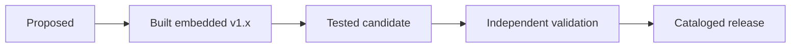
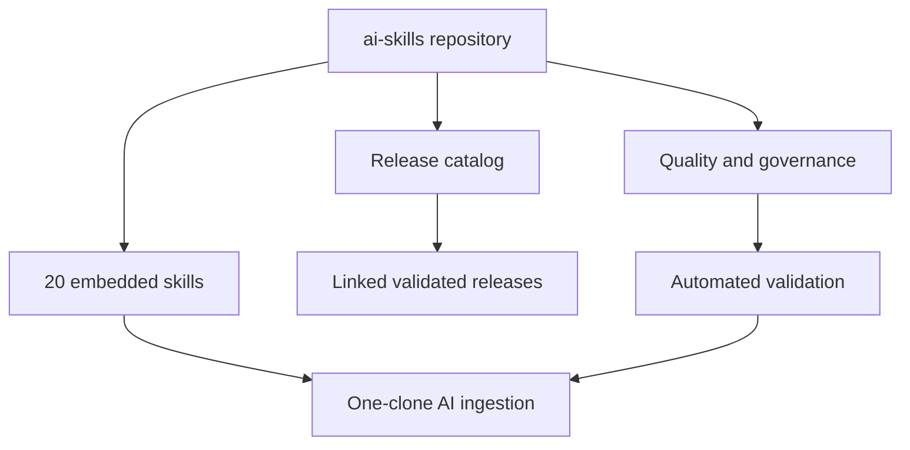

# AI Skills by Skylar Lyons

[](https://github.com/swl126/ai-skills/actions/workflows/validate.yml)
[](https://github.com/swl126/ai-skills/actions/workflows/verify-linked-skills.yml)
[](LICENSE)

A one-clone collection, catalog, and quality framework for reusable AI-agent skills.

The goal is not to collect prompt snippets. It is to publish operational skills that an unfamiliar AI can discover, ingest, execute, test, and audit. This repository uses a hybrid distribution model: 20 skills are embedded for immediate local ingestion, while independently released skills retain their own versioned repositories and are indexed here.

## Repository status

| Measure | Current state |
| --- | ---: |
| Validated skills | 2 |
| Embedded skills | 20 |
| Approved proposals | 20 |
| Public license | GPL-3.0-or-later |
| Catalog format | JSON with schema |
| Validation | Local tests, GitHub Actions, and remote integrity checks |
| Repository version | 3.1.0 |

## Quick start for AI ingestion

Clone once. Every embedded skill is then available locally under `skills/`; no additional repository navigation is required.

```bash
git clone https://github.com/swl126/ai-skills.git
cd ai-skills

# Print canonical paths for all embedded skills.
python3 scripts/list_embedded_skills.py

# Confirm that every package is complete and internally consistent.
python3 scripts/validate_embedded_skills.py
```

An agent should read [`embedded-skills.json`](embedded-skills.json), select the relevant entry, and load the referenced `SKILL.md` before acting. It should preserve each skill's required inputs, workflow, output contract, and safety boundaries.

## Independently validated releases

| Skill | Version | Capability | Validation |
| --- | ---: | --- | --- |
| [ENDGAME](https://github.com/swl126/endgame) | 1.1.0 | High-rigor orchestration with acceptance gates, selective routing, testing, adversarial review, and proof of completion | [Workflow](https://github.com/swl126/endgame/actions) |
| [Universal Spreadsheet Engine](https://github.com/swl126/Spreadsheet_runner) | 1.0.0 | Deterministic spreadsheet inspection, transformation, and reusable Python or R recipe generation | [Workflow](https://github.com/swl126/Spreadsheet_runner/actions) |

These are the only repositories currently represented as independently validated releases. They are separate from the 20 fully built embedded version `1.x` skills below; embedded status means locally ingestible and repository-tested, not independently production-validated.

## Twenty embedded skills

All 20 approved concepts are implemented as self-contained packages under [`skills/`](skills/README.md). Each package includes an entrypoint, operational playbook, report template, realistic fixture, UI discovery metadata, deterministic report validator, behavioral tests, and a machine-readable package manifest. The [proposal record](PROPOSED_SKILLS.md) remains as design provenance.

| Embedded skill | Primary use |
| --- | --- |
| [`model-evaluation-harness`](skills/model-evaluation-harness/SKILL.md) | Repeatable model, prompt, and agent evaluation |
| [`prompt-injection-tester`](skills/prompt-injection-tester/SKILL.md) | Authorized prompt-injection and indirect-injection testing |
| [`agent-permission-auditor`](skills/agent-permission-auditor/SKILL.md) | Least-privilege review for agent tools and credentials |
| [`api-contract-auditor`](skills/api-contract-auditor/SKILL.md) | API implementation and contract consistency |
| [`row-level-security-auditor`](skills/row-level-security-auditor/SKILL.md) | Tenant-isolation and RLS policy review |
| [`database-migration-guardian`](skills/database-migration-guardian/SKILL.md) | Safe schema migration planning and verification |
| [`secrets-hygiene-auditor`](skills/secrets-hygiene-auditor/SKILL.md) | Secret exposure detection and remediation planning |
| [`dependency-risk-auditor`](skills/dependency-risk-auditor/SKILL.md) | Dependency vulnerability and maintenance risk |
| [`sbom-builder`](skills/sbom-builder/SKILL.md) | Reproducible software bill of materials generation |
| [`configuration-drift-detector`](skills/configuration-drift-detector/SKILL.md) | Declared-versus-observed configuration comparison |
| [`incident-postmortem-builder`](skills/incident-postmortem-builder/SKILL.md) | Evidence-based, blameless incident analysis |
| [`disaster-recovery-exercise`](skills/disaster-recovery-exercise/SKILL.md) | Recovery drills and restoration evidence |
| [`observability-designer`](skills/observability-designer/SKILL.md) | Signals, service objectives, dashboards, and alerts |
| [`release-readiness-gate`](skills/release-readiness-gate/SKILL.md) | Evidence-backed go/no-go release decisions |
| [`architecture-decision-recorder`](skills/architecture-decision-recorder/SKILL.md) | Durable architecture decision records |
| [`policy-to-controls-mapper`](skills/policy-to-controls-mapper/SKILL.md) | Policy requirement to technical-control traceability |
| [`privacy-impact-assessor`](skills/privacy-impact-assessor/SKILL.md) | Personal-data flow and privacy-risk assessment |
| [`dataset-documenter`](skills/dataset-documenter/SKILL.md) | Dataset provenance, limitations, and intended use |
| [`synthetic-data-validator`](skills/synthetic-data-validator/SKILL.md) | Utility, fidelity, and disclosure-risk testing |
| [`reproducible-research-packager`](skills/reproducible-research-packager/SKILL.md) | Reconstructable research artifacts and provenance |

### Executable gold-standard package

[`model-evaluation-harness`](skills/model-evaluation-harness/SKILL.md) version `1.1.0` is the first embedded package promoted beyond report workflow into domain execution. Its dependency-free CLI validates frozen evaluation contracts, scores collected JSONL outputs, calculates case and slice results with Wilson intervals, preserves critical failures, compares baseline regressions, writes JSON and Markdown evidence, and can fail CI on a `BLOCK` decision.

```bash
cd skills/model-evaluation-harness
python3 scripts/eval_harness.py validate \
  --spec examples/fixtures/spec.json \
  --cases examples/fixtures/cases.jsonl
python3 tests/test_eval_harness.py
```

## Find a skill

Clone this catalog and use the dependency-free command-line search:

```bash
git clone https://github.com/swl126/ai-skills.git
cd ai-skills

python3 scripts/skills.py
python3 scripts/skills.py spreadsheet
python3 scripts/skills.py --status validated --json
```

The released catalog is available as both [human-readable documentation](SKILLS.md) and machine-readable [`catalog.json`](catalog.json).

## Install a released skill

Clone the individual repository and keep its complete directory. `SKILL.md` is the canonical instruction entry point, but referenced scripts, tests, examples, and supporting material are part of the portable skill.

```bash
git clone https://github.com/swl126/endgame.git
cd endgame
python3 scripts/validate_skill.py
```

Or:

```bash
git clone https://github.com/swl126/Spreadsheet_runner.git
cd Spreadsheet_runner
python3 -m unittest discover -s tests -v
```

Installation locations and adapter metadata vary by agent platform. See the [compatibility matrix](COMPATIBILITY.md) before treating platform adaptation as native support.

## Maturity and lifecycle



Embedding makes a skill portable and usable from one clone. It does not automatically promote that skill into the independently validated release catalog. Promotion requires documented provenance, compatible licensing, operational instructions, deterministic validation, and a passing default-branch workflow.

## ENDGAME governance

Substantial changes and releases use the canonical [ENDGAME](https://github.com/swl126/endgame) discipline. The hub pins the governing version and source commit rather than duplicating the skill. See [ENDGAME.md](ENDGAME.md), the machine-readable [ENDGAME.json](ENDGAME.json) evidence ledger, and the [acceptance gates](endgame/ACCEPTANCE_GATES.md).

## Quality contract

Every embedded skill must include valid YAML frontmatter, discriminating trigger guidance, required inputs, an actionable workflow, a defined output contract, and explicit safety and authority boundaries. The manifest, directory set, proposal provenance, names, versions, and distribution metadata must reconcile under automated validation.

In addition, every independently validated skill repository must include:

- a root `SKILL.md` with valid YAML frontmatter;
- concrete trigger conditions and important exclusions;
- required inputs, workflow, output contract, and completion gates;
- relevant safety and authority boundaries;
- a root `README.md`, `LICENSE`, `VERSION`, and `CHANGELOG.md`;
- contribution and security guidance;
- deterministic validation through scripts or tests;
- validation automation for pushes and pull requests.

The normative requirements are in [STANDARD.md](STANDARD.md). A reusable starting point is available in [`templates/SKILL.template.md`](templates/SKILL.template.md).

## Validation and trust

Run the complete catalog checks locally:

```bash
python3 scripts/validate_catalog.py
python3 scripts/validate_embedded_skills.py
python3 scripts/test_embedded_skills.py
python3 -m unittest discover -s tests -v
python3 scripts/endgame_audit.py
python3 scripts/verify_remote.py
```

The checks establish that required files exist, metadata is internally consistent, declared versions match public repositories, licenses contain GNU GPL text, tests pass, and linked public files remain reachable.

Validation does **not** guarantee that every output an AI produces is correct or that every platform interprets instructions identically. Review [TRUST.md](TRUST.md) before granting an agent credentials, external-write authority, network access, or destructive capabilities.

## Architecture



The repository contains executable instructions for the embedded collection as well as discovery and governance metadata for independently released skills.

## Repository map

| Resource | Purpose |
| --- | --- |
| [`catalog.json`](catalog.json) | Released, validated skill records |
| [`proposals.json`](proposals.json) | Original approved design provenance for the embedded skills |
| [`embedded-skills.json`](embedded-skills.json) | Installed embedded skills and canonical ingestion paths |
| [`skills/`](skills/README.md) | Twenty locally ingestible skill packages |
| [SKILLS.md](SKILLS.md) | Human-readable released catalog |
| [PROPOSED_SKILLS.md](PROPOSED_SKILLS.md) | Original prioritized design record for the embedded collection |
| [STANDARD.md](STANDARD.md) | Normative repository and admission requirements |
| [TRUST.md](TRUST.md) | Validation scope and maturity model |
| [COMPATIBILITY.md](COMPATIBILITY.md) | Cross-platform portability boundaries |
| [ROADMAP.md](ROADMAP.md) | Ecosystem development phases |
| [CANDIDATES.md](CANDIDATES.md) | Privacy-conscious candidate admission process |
| [docs/QUICKSTART.md](docs/QUICKSTART.md) | Short operational guide |
| [ENDGAME.md](ENDGAME.md) | High-rigor repository governance profile |
| [ENDGAME.json](ENDGAME.json) | Pinned source, gates, version, and audit evidence |
| [CHANGELOG.md](CHANGELOG.md) | Versioned hub changes |

## Contributing

Read [CONTRIBUTING.md](CONTRIBUTING.md), conform the proposed repository to [STANDARD.md](STANDARD.md), run the validation suite, and submit the supplied pull-request checklist. New skill proposals can use the structured GitHub issue template.

Private repository names, contents, and audit findings are not published through the candidate process. A private project must be intentionally made public before it can enter public catalog review.

## License

This repository, including its embedded skills, is licensed under [GNU GPL version 3 or any later version](LICENSE). Each independently linked repository carries its own compatible license file.
