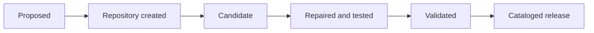
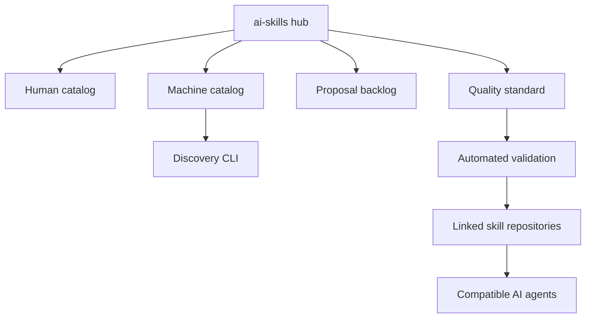

# AI Skills by Skylar Lyons

[](https://github.com/swl126/ai-skills/actions/workflows/validate.yml)
[](https://github.com/swl126/ai-skills/actions/workflows/verify-linked-skills.yml)
[](LICENSE)

A public catalog and quality framework for reusable AI-agent skills.

The goal is not to collect prompt snippets. It is to publish skills that an unfamiliar agent can discover, execute, test, and audit. Production skills remain in separate repositories so each one can be installed, versioned, validated, cited, and maintained independently.

## Repository status

| Measure | Current state |
| --- | ---: |
| Validated skills | 2 |
| Approved proposals | 20 |
| Public license | GPL-3.0-or-later |
| Catalog format | JSON with schema |
| Validation | Local tests, GitHub Actions, and remote integrity checks |
| Repository version | 1.1.0 |

## Validated skills

| Skill | Version | Capability | Validation |
| --- | ---: | --- | --- |
| [ENDGAME](https://github.com/swl126/endgame) | 1.1.0 | High-rigor orchestration with acceptance gates, selective routing, testing, adversarial review, and proof of completion | [Workflow](https://github.com/swl126/endgame/actions) |
| [Universal Spreadsheet Engine](https://github.com/swl126/Spreadsheet_runner) | 1.0.0 | Deterministic spreadsheet inspection, transformation, and reusable Python or R recipe generation | [Workflow](https://github.com/swl126/Spreadsheet_runner/actions) |

These are the only repositories currently represented as validated. Planned work is tracked separately so proposals cannot be mistaken for released capabilities.

## Twenty-skill expansion

The [proposed-skill backlog](PROPOSED_SKILLS.md) defines 20 additional standalone skills across:

- AI assurance and AI security;
- software, data, platform, and privacy engineering;
- supply-chain security;
- reliability, resilience, and release assurance;
- governance, architecture, and reproducible research.

Machines and agents can consume the same backlog from [`proposals.json`](proposals.json) and validate it against [`schema/proposals.schema.json`](schema/proposals.schema.json).

## Find a skill

Clone this catalog and use the dependency-free command-line search:

```bash
git clone https://github.com/swl126/ai-skills.git
cd ai-skills

python3 scripts/skills.py
python3 scripts/skills.py spreadsheet
python3 scripts/skills.py --status validated --json
```

The released catalog is available as both [human-readable documentation](SKILLS.md) and machine-readable [`catalog.json`](catalog.json).

## Install a released skill

Clone the individual repository and keep its complete directory. `SKILL.md` is the canonical instruction entry point, but referenced scripts, tests, examples, and supporting material are part of the portable skill.

```bash
git clone https://github.com/swl126/endgame.git
cd endgame
python3 scripts/validate_skill.py
```

Or:

```bash
git clone https://github.com/swl126/Spreadsheet_runner.git
cd Spreadsheet_runner
python3 -m unittest discover -s tests -v
```

Installation locations and adapter metadata vary by agent platform. See the [compatibility matrix](COMPATIBILITY.md) before treating platform adaptation as native support.

## Skill lifecycle



A concept is not added to the released catalog merely because it sounds useful. It must have a public repository, documented provenance, compatible licensing, operational instructions, deterministic validation, and a passing default-branch workflow.

## ENDGAME governance

Substantial changes and releases use the canonical [ENDGAME](https://github.com/swl126/endgame) discipline. The hub pins the governing version and source commit rather than duplicating the skill. See [ENDGAME.md](ENDGAME.md), the machine-readable [ENDGAME.json](ENDGAME.json) evidence ledger, and the [acceptance gates](endgame/ACCEPTANCE_GATES.md).

## Quality contract

Every validated skill repository must include:

- a root `SKILL.md` with valid YAML frontmatter;
- concrete trigger conditions and important exclusions;
- required inputs, workflow, output contract, and completion gates;
- relevant safety and authority boundaries;
- a root `README.md`, `LICENSE`, `VERSION`, and `CHANGELOG.md`;
- contribution and security guidance;
- deterministic validation through scripts or tests;
- validation automation for pushes and pull requests.

The normative requirements are in [STANDARD.md](STANDARD.md). A reusable starting point is available in [`templates/SKILL.template.md`](templates/SKILL.template.md).

## Validation and trust

Run the complete catalog checks locally:

```bash
python3 scripts/validate_catalog.py
python3 -m unittest discover -s tests -v
python3 scripts/endgame_audit.py
python3 scripts/verify_remote.py
```

The checks establish that required files exist, metadata is internally consistent, declared versions match public repositories, licenses contain GNU GPL text, tests pass, and linked public files remain reachable.

Validation does **not** guarantee that every output an AI produces is correct or that every platform interprets instructions identically. Review [TRUST.md](TRUST.md) before granting an agent credentials, external-write authority, network access, or destructive capabilities.

## Architecture



The hub contains discovery and governance metadata. Executable skill behavior remains in the linked repositories.

## Repository map

| Resource | Purpose |
| --- | --- |
| [`catalog.json`](catalog.json) | Released, validated skill records |
| [`proposals.json`](proposals.json) | Approved but unimplemented skill concepts |
| [SKILLS.md](SKILLS.md) | Human-readable released catalog |
| [PROPOSED_SKILLS.md](PROPOSED_SKILLS.md) | Prioritized 20-skill development backlog |
| [STANDARD.md](STANDARD.md) | Normative repository and admission requirements |
| [TRUST.md](TRUST.md) | Validation scope and maturity model |
| [COMPATIBILITY.md](COMPATIBILITY.md) | Cross-platform portability boundaries |
| [ROADMAP.md](ROADMAP.md) | Ecosystem development phases |
| [CANDIDATES.md](CANDIDATES.md) | Privacy-conscious candidate admission process |
| [docs/QUICKSTART.md](docs/QUICKSTART.md) | Short operational guide |
| [ENDGAME.md](ENDGAME.md) | High-rigor repository governance profile |
| [ENDGAME.json](ENDGAME.json) | Pinned source, gates, version, and audit evidence |
| [CHANGELOG.md](CHANGELOG.md) | Versioned hub changes |

## Contributing

Read [CONTRIBUTING.md](CONTRIBUTING.md), conform the proposed repository to [STANDARD.md](STANDARD.md), run the validation suite, and submit the supplied pull-request checklist. New skill proposals can use the structured GitHub issue template.

Private repository names, contents, and audit findings are not published through the candidate process. A private project must be intentionally made public before it can enter public catalog review.

## License

This catalog is licensed under [GNU GPL version 3 or any later version](LICENSE). Each linked repository must carry its own compatible license file.
