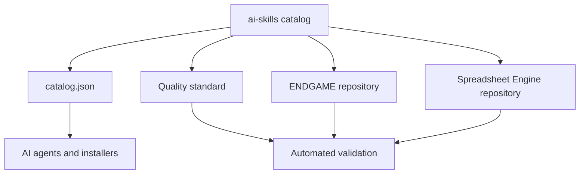

# AI Skills by Skylar Lyons

A curated, machine-readable collection of reusable skills for AI agents.

This repository is the catalog and quality-control hub. Each production skill lives in its own repository so it can be installed, versioned, tested, and cited independently.

## Available skills

| Skill | Purpose | Status | License |
| --- | --- | --- | --- |
| [ENDGAME](https://github.com/swl126/endgame) | High-rigor orchestration for substantial, consequential work | Validated | GPL-3.0-or-later |
| [Universal Spreadsheet Engine](https://github.com/swl126/Spreadsheet_runner) | Reproducible spreadsheet workflows with Python or R recipe runners | Validated | GPL-3.0-or-later |

See [SKILLS.md](SKILLS.md) for capabilities and compatibility. Agents and tooling can consume [catalog.json](catalog.json).

## What makes a repository an AI skill?

Every listed repository must:

1. include a root `SKILL.md` with valid YAML frontmatter;
2. state clear trigger conditions, exclusions, inputs, outputs, and completion criteria;
3. keep instructions executable rather than promotional;
4. include examples and a deterministic validation path;
5. declare `GPL-3.0-or-later` licensing;
6. pass its repository checks before it is marked validated.

The full contract is in [STANDARD.md](STANDARD.md).

## Installation

Clone the individual repository you want, then place it where your AI environment loads skills. The portable unit is the repository directory containing `SKILL.md` and its referenced files.

```bash
git clone https://github.com/swl126/endgame.git
git clone https://github.com/swl126/Spreadsheet_runner.git
```

Exact installation paths differ by agent platform. The compatibility matrix records what is natively supported versus adaptable.

## Architecture



## Contributing

Use [CONTRIBUTING.md](CONTRIBUTING.md) to propose a new skill or improve the catalog. Catalog entries are accepted only after validation.

## License

This catalog is licensed under [GPL-3.0-or-later](LICENSE). Linked skill repositories carry their own license files.
